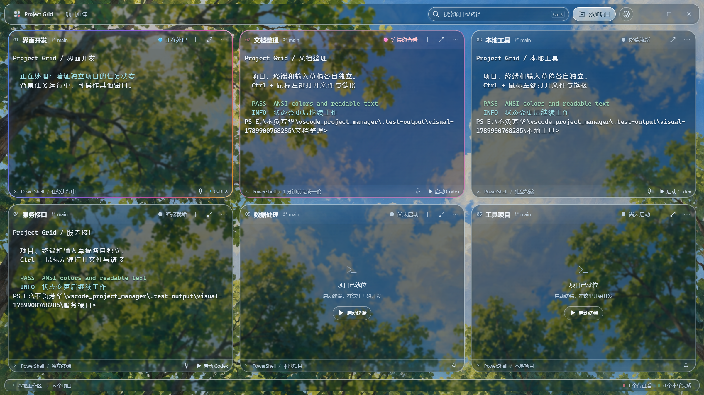
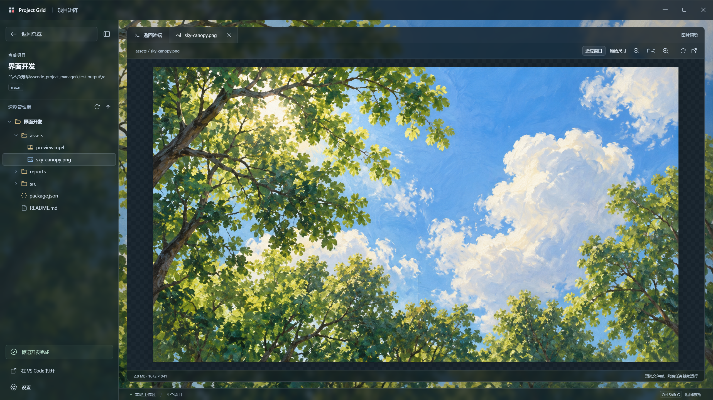
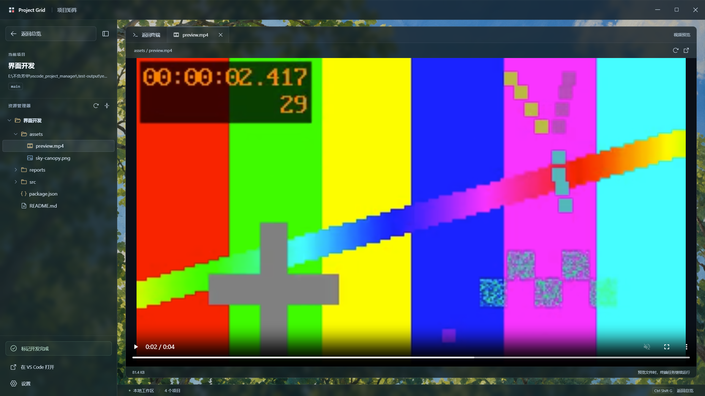

<p align="center">
  
</p>

<h1 align="center">Project Grid · 项目矩阵</h1>

<p align="center"><strong>多个项目，一屏掌握。红框亮起，继续下一轮。</strong></p>
<p align="center">A local workspace for parallel Codex projects, live terminals, and completion alerts.</p>

<p align="center">
  <a href="https://github.com/noeigenstate/project-manager/releases/latest"></a>
  <a href="https://github.com/noeigenstate/project-manager/actions/workflows/build-windows.yml"></a>
  
  
</p>

<p align="center">
  <a href="https://github.com/noeigenstate/project-manager/releases/latest"><strong>下载 Windows 版</strong></a> ·
  <a href="#亮点功能">亮点功能</a> ·
  <a href="#开始使用">开始使用</a> ·
  <a href="#未来展望">未来展望</a> ·
  <a href="docs/usage.md">使用文档</a>
</p>

<p align="center">
  
</p>
<p align="center"><sub>真实桌面界面，使用演示项目展示。油画里的树影、蓝天与白云，衬托清晰的磨玻璃工作区。</sub></p>

## 为什么做 Project Grid

同时开发几个项目时，最容易错过的，是另一个窗口里早已结束的任务。

Project Grid 把项目放进同一个窗口：每个方框都有独立终端，Codex 每轮结束时用短暂呼吸光晕提醒，随后保持静态红框。点开处理、继续下达指令，再回到总览；其他项目始终可以继续运行。

## 亮点功能

### 🧩 所有项目，一屏可见

添加本地目录或 Linux SSH 项目，网格随项目数量自动排列。本地使用 PowerShell，远程使用 Bash，保留 Codex 的终端交互和 ANSI 色彩。搜索、添加项目和设置收进顶部栏，把更多空间留给代码与输出。

按住项目顶部，整个真实方框会随鼠标移动，周围项目平滑让位并依次排列。松开即可保存顺序，拖动期间仍能看到终端的实时输出。

点击项目顶部标题栏或展开按钮，卡片会从当前位置逐渐放大，返回时缩回网格。终端正文、输入区和底栏保持小窗口，可直接输入、选字和复制。切换过程保留终端会话与未发送的输入。默认使用平滑缩放，可在设置中选择跟随系统或关闭动画。

同一个项目也可以同时开多个终端：点击标题栏的 **＋**，自动分屏排列。每个终端有独立输入、Codex 状态与关闭按钮；重开应用时分别恢复各自的会话，关闭其中一个不会重启其他终端。

### 🌐 本地与服务器，放在同一张网格里

沿用 VS Code Remote-SSH 的主机配置，选择主机、填写远程目录即可连接。终端、文件目录、图片、HTML 和视频预览都通过 SSH 访问，无需把整个项目下载到本机。密钥、端口和跳板机沿用已有配置，密码仅用于当次认证。

### ⏯️ 重新打开，接着上次写

启动时自动恢复上次打开的终端，并进入对应目录最近的 Codex 会话。检测到上一轮被中断时，自动发送「继续」；已经结束的一轮只恢复对话，等待你的下一条指令。标绿完成的项目保持安静，也可以在设置中关闭自动恢复。

### 📋 输出随手复制，指令直接粘贴

鼠标选中终端文字即可用 Ctrl+C 复制，右键可「复制全部终端文字」，包含当前缓冲区里的历史输出。Ctrl+V、Ctrl+Shift+V 和 Shift+Insert 均可粘贴指令；搜索框、SSH 主机和认证输入框也支持常规粘贴。

### 🎙️ 说出指令，在本机转成文字

点击项目底部的麦克风，可检测设备与音量、录音并离线转写。识别结果可以编辑，再插入当前终端，由你确认发送。首次下载约 64 MB 的引擎和多语言模型后，无需 API 密钥，录音不会上传。

### 📂 常用文件操作，留在工作区内

资源管理器支持新建文件与文件夹、重命名、删除、Ctrl/Shift 多选和复制粘贴。复制的文件可以直接粘贴到 Windows 资源管理器；SSH 文件会先下载到本机缓存，也能把本机剪贴板文件上传到远程项目。

从电脑复制文件或文件夹后，可在目标目录按 Ctrl+V、右键选择“粘贴”，或点击目录栏的粘贴按钮。点击列表空白处可粘贴到项目根目录，重名文件会另存副本。

右键文件或文件夹，可以复制 **绝对路径** 或 **相对路径**；支持多选，也可按 Ctrl+Shift+C 复制绝对路径。SSH 项目复制的是服务器上的 Linux 路径。

打开文本或 HTML 后点击 **编辑**，直接修改并按 **Ctrl+S** 保存。保存会保留原编码、BOM 和换行格式；外部程序改动过文件时会提示冲突，切换文件或退出前会提醒处理未保存内容。大文件按段编辑，保存当前段时保留其余内容。

### 🔴 每次完成，都有明确提醒

运行状态按当前主会话的轮次记录同步：子任务先结束时，主任务仍显示「正在处理」；主任务结束后才提醒。中断、等待指令与完成分别显示，已结束的历史记录不会让新任务提前变绿。

| 状态 | 表示什么 | 接下来怎么做 |
| --- | --- | --- |
| 🔴 短暂呼吸后静态红框 | Codex 本轮结束，等你查看 | 点击进入全屏，检查结果并继续下达指令 |
| 🟢 绿框常亮 | 你已确认整个项目开发完成 | 放在总览里，需要时选择「继续开发」 |
| ⚪ 常规边框 | 终端就绪或 Codex 会话已打开 | 继续工作；会话状态不等同于模型正在生成 |

红框会保留到你查看为止，搜索、切换窗口或关闭到托盘都不会清掉提醒。还可以在设置中开启系统通知和提示音。
每次提交新指令后只提醒一次；呼吸提示约 9 秒后停止。没有提交下一条指令时，即使后台再次发送不同 ID 的完成事件，也不会重复提醒、累计未读或刷新完成时间。查看结果、切换窗口和重启软件不会重新启用旧提醒，绿色开发完成始终常亮。

状态通过右上角发光圆点、柔和边框与侧边光条呈现：处理时为蓝色，等待查看为粉色，完成为绿色。终端中不再覆盖悬浮提示条，点击右上角等待状态即可展开查看。

### 🖥️ 点开专注，返回继续总览

点击项目标题或红框，进入原生全屏。左侧展开熟悉的文件目录，查看代码与产物；目录栏可以收起，给终端让出空间。返回总览时，原来的终端与任务仍然保留。

### 🎬 生成的结果，直接在这里看

| 文件与操作 | 应用内体验 | 带来的便利 |
| --- | --- | --- |
| PNG、JPEG、WebP、GIF、ICO 等 | 直接看图，适应窗口、原尺寸、缩放 | 不必另外寻找图片查看器 |
| HTML / HTM | 渲染网页，可切换源码；支持项目内图片、CSS、脚本和 JSON | 不必为了查看静态报告反复切换窗口 |
| MP4、WebM 等视频 | 播放、暂停、拖动进度、音量、全屏 | 不必先打开独立播放器 |
| 大文本、日志与 HTML 源码 | 分段读取、按页跳转，只渲染可见行 | 不再因为超过 1 MiB 被要求换编辑器 |
| Ctrl + 鼠标左键 | 网页链接打开浏览器，项目内文件直接预览 | 不必复制路径再去找文件 |

<table>
  <tr>
    <td width="50%"></td>
    <td width="50%"></td>
  </tr>
  <tr>
    <td align="center">看图、检查细节</td>
    <td align="center">播放视频、检查输出</td>
  </tr>
</table>

文件预览期间，终端任务继续运行。产物更新后点击刷新，就能查看新的内容。

### 🌿 让长时间工作更舒服

树影、蓝天、白云的油画背景，搭配借鉴 Liquid Glass 层次感的玻璃界面：圆润边缘、柔和高光、悬浮胶囊按钮与开关，按下时有轻微回弹。工具与导航更通透，终端正文使用更深的阅读底色。系统启用减少动态效果或减少透明度时，会相应简化效果。详见 [材质设计说明](docs/glass-material.md)。

### 🔄 安装一次，后续更新更省心

Windows 安装版会自动检查新版本，在后台下载更新。设置中可以查看当前版本、下载进度，并一键重启安装；仍有终端打开时，会先确认是否结束任务。更新不会擅自重启正在工作的窗口。

## 开始使用

**Windows 10 / 11 · x64。Codex CLI 安装在实际运行项目的本机或远程主机上。**

1. 从 [Releases 下载最新版](https://github.com/noeigenstate/project-manager/releases/latest)，运行 `Project-Grid-Setup-版本号-x64.exe` 完成安装，后续可自动检查和下载更新。临时使用也可选择免安装的 `Project-Grid-版本号-win-x64.exe`。
2. 点击顶部 **添加项目**，选择「本地项目」或「SSH 远程项目」。远程项目填写主机别名与 Linux 目录；服务器需要 Python 3.6+、Bash。在终端输入 `codex`，或点击 **启动 Codex**。
3. 红框亮起后点开，查看结果并继续对话。完成后点击 **返回总览**。
4. 整个项目做完时，点击 **标记开发完成**，让它以绿色常亮留在总览中。

> **从旧版迁移：**先等任务结束，再从设置或托盘退出旧版，运行新的安装包。只关闭窗口可能仍在托盘运行。项目列表和完成标记会保留；安装版后续更新可在设置中完成，便携版需要手动下载新文件。

| 快捷操作 | 功能 |
| --- | --- |
| `Ctrl + K` | 总览中搜索项目 |
| `Ctrl + B` | 全屏项目中展开或收起目录 |
| `Ctrl + Shift + G` | 返回项目总览 |
| `Ctrl + 鼠标左键` | 打开终端中的链接 |
| `Ctrl + C` / `Ctrl + Shift + C` | 复制选中的终端文字；未选中时 Ctrl+C 中断命令 |
| `Ctrl + Shift + A` | 全选终端文字 |
| `Ctrl + V` / `Ctrl + Shift + V` / `Shift + Insert` | 粘贴到终端 |
| `Shift + Enter` | 在当前输入中换行；普通 Enter 提交 |
| 终端右键 | 复制、复制全部终端文字、全选、粘贴 |

## 几个实用说明

<details>
<summary><strong>红框是「本轮结束」，绿框是「项目完成」</strong></summary>

红框来自本应用终端中 Codex 的完成通知。终端退出、普通命令结束、长时间没有输出，都不会被误判为开发完成。绿色由你手动确认；后续新一轮任务完成时，仍会重新亮红，避免漏看。

</details>

<details>
<summary><strong>与现有 VS Code 如何配合？</strong></summary>

Project Grid 为所选目录创建独立终端，不会搬入 VS Code 中已经运行的终端。需要继续已有 Codex 对话时，可在结束原窗口会话后使用 `codex resume`。需要编辑文件时，可通过项目菜单或预览工具栏在 VS Code 打开。

SSH 主机列表从 VS Code 的 SSH 配置中读取，支持 `remote.SSH.configFile` 指定的配置文件。远程项目的「在 VS Code 打开」会连接对应 SSH 主机。

窗口默认关闭到托盘，任务继续运行。真正退出后，项目目录、未读记录、绿色标记及恢复状态保存在本机；下次启动按设置恢复 Codex 会话。对话历史由各主机上的 Codex CLI 保存，普通 shell 命令不会自动重跑。详见 [会话恢复](docs/usage.md#自动恢复-codex-会话)。

</details>

<details>
<summary><strong>大文件、网页和视频有哪些注意事项？</strong></summary>

没有固定的文本、图片或 HTML 文件大小门槛。大文本按约 256 KiB 分页，支持 UTF-8 和带 BOM 的 UTF-16；行号与复制针对当前页。图片解码和复杂网页渲染仍受可用内存影响。

视频按需读取。MP4（H.264）与 WebM 已做实际播放验证；本地文件编码不被内置播放器支持时，可选择系统播放器，远程文件需先下载后在本机播放。

HTML 在独立来源的隔离框架中运行，不能访问应用的 Node.js 或终端接口。支持项目内相对资源，HTTPS CDN 需要联网；依赖开发服务器的前端源码应先构建再预览。相对文件链接按项目根目录解析。

</details>

## 未来展望

接下来希望让多项目协作更顺手。以下是规划方向，尚未上线，欢迎通过 [Issues](https://github.com/noeigenstate/project-manager/issues) 讨论优先级。

- [ ] **项目分组与快捷切换**：按客户、产品或开发阶段组织工作区。
- [ ] **更丰富的 Agent 接入**：让更多命令行编码助手接入统一的完成提醒。
- [ ] **任务与产物记录**：更容易回看每一轮的结果，快速找到生成的图片、网页和视频。
- [ ] **更强的文件查看**：大文件搜索、行号定位与更丰富的格式支持。
- [ ] **更多运行环境**：探索 macOS、Linux 桌面客户端，以及 WSL 工作区。

## 本地开发

使用 Windows 与 Node.js 24：

```powershell
git clone https://github.com/noeigenstate/project-manager.git
cd project-manager
npm ci
npm start
```

```powershell
npm run build          # 类型检查与前端构建
npm test               # 状态、文件读取、链接与资源访问测试
npm run test:desktop   # 真实桌面、终端、图片与视频交互验证
npm run test:sessions  # 重启恢复、复制粘贴与 SSH 桌面交互验证
npm run test:workspace # 文件操作、模拟麦克风与语音输入界面验证
npm run dist           # 构建 Windows 安装版、便携版与更新文件
```

采用 **Electron · React · TypeScript · xterm.js · node-pty · OpenSSH**。GitHub Actions 自动构建 Windows 安装版和便携版；版本标签通过单元测试、打包版桌面测试和 Linux SSH 集成测试后发布到 Releases，并附自动更新文件与 SHA-256 校验信息。详细说明见 [开发与发布文档](docs/usage.md#github-自动构建)。

---

<p align="center">
  <strong>让任务继续运行，让注意力回到需要你的项目。</strong><br />
  <a href="https://github.com/noeigenstate/project-manager/releases/latest">下载体验</a> ·
  <a href="https://github.com/noeigenstate/project-manager/issues">反馈问题与建议</a>
</p>
